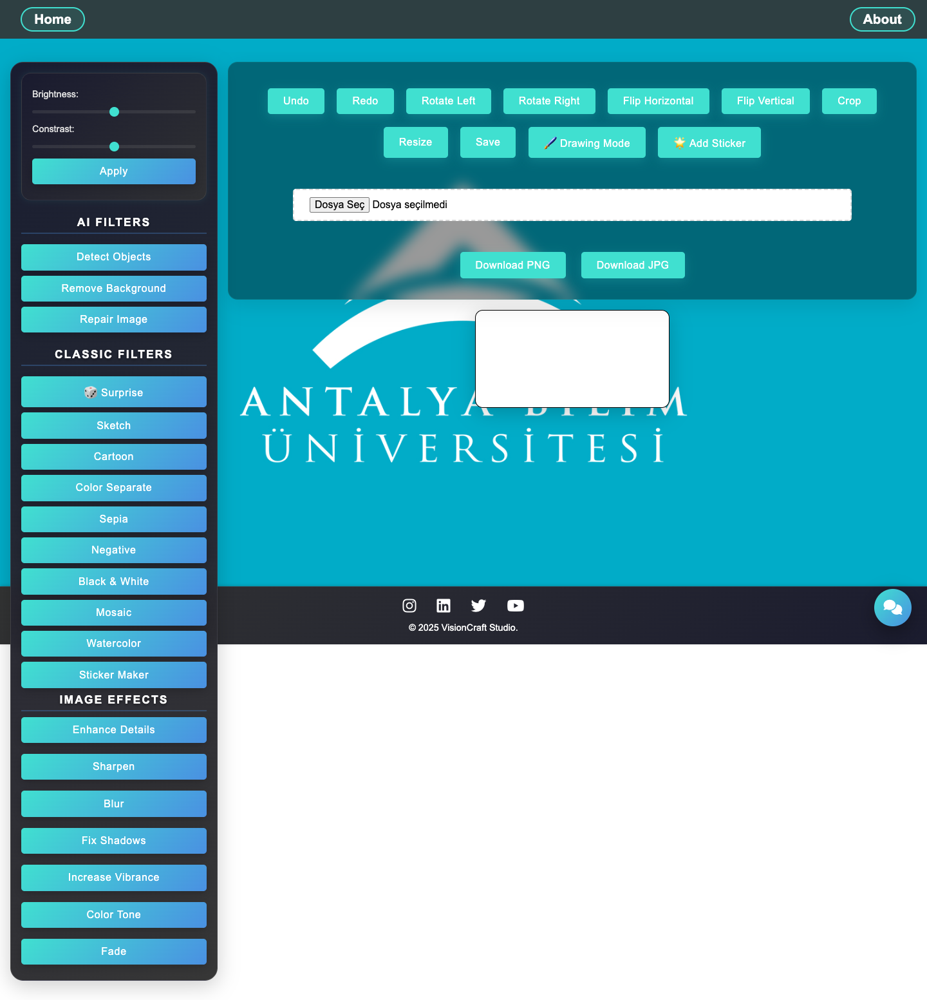
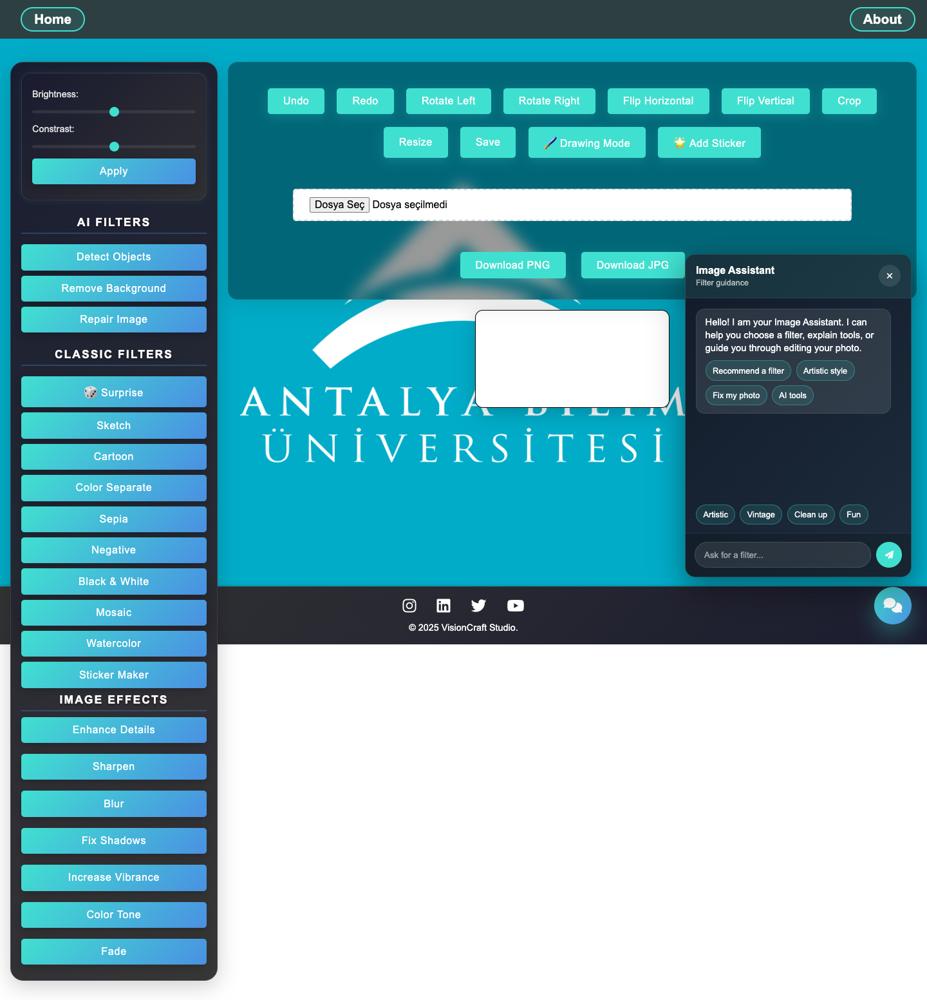

# VisionCraft Studio

VisionCraft Studio is a browser-based image processing and photo editing project. Users can upload an image, apply filters, use basic editing tools, and download the edited result as PNG or JPG.

This project was developed as a graduation project at Antalya Bilim University. It combines image processing algorithms, the HTML Canvas API, JavaScript-based pixel manipulation, a modular frontend structure, and an interactive user interface.

## Project Goal

The goal of this project is to provide basic and intermediate image processing features through a user-friendly web interface. The application is designed to run directly in the browser without requiring a desktop image editing program.

## Key Features

- Image upload and canvas preview
- PNG and JPG export
- Brightness and contrast adjustment
- Undo and redo actions
- Left and right rotation
- Horizontal and vertical flipping
- Mouse-based cropping
- Selected-area resizing
- Free drawing mode
- Eraser mode
- Sticker insertion, dragging, and resizing
- First-visit onboarding flow
- Tooltip-supported controls
- Bottom-right English filter recommendation chatbot
- About page and developer profile

## Screenshots

### Main Editor



### Image Assistant



## Image Processing Filters

The application includes several JavaScript-based pixel manipulation filters:

- Sketch
- Cartoon
- Color Separate
- Sepia
- Negative
- Black & White
- Mosaic
- Watercolor
- Sticker Maker
- Enhance Details
- Sharpen
- Blur
- Fix Shadows
- Increase Vibrance
- Color Tone
- Fade
- Repair Image

## AI-Supported Features

Some AI-supported features were tested with TensorFlow.js and COCO-SSD:

- Object detection
- Drawing bounding boxes around detected objects
- Basic background removal approach

Some advanced AI ideas are included as prototypes in the codebase. Style transfer, face beautification, portrait effects, and smart enhancement may require additional model files or more stable library integrations.

## Technologies

- HTML5
- CSS3
- JavaScript
- ES Modules
- Canvas API
- TensorFlow.js
- COCO-SSD
- MediaPipe
- Font Awesome

## Architecture

The project uses a feature-based ES Modules architecture that is compatible with modern browsers. The core image processing logic is kept in `script.js`, while the chatbot, onboarding flow, and shared DOM helpers are organized under the `src/` directory.

Detailed architecture documentation: [docs/ARCHITECTURE.md](docs/ARCHITECTURE.md)

## Project Structure

```text
.
├── index.html
├── about.html
├── script.js
├── style.css
├── background.jpg
├── batuhan-profile.jpeg
├── docs
│   └── ARCHITECTURE.md
├── src
│   ├── app.js
│   ├── features
│   │   ├── chatbot
│   │   │   └── chatbot.js
│   │   └── onboarding
│   │       └── onboarding.js
│   └── shared
│       └── dom.js
└── styles
    ├── index.css
    └── navbar.css
```

## How to Run

1. Download or clone the project folder.
2. Start a small local server inside the project folder:

```bash
python3 -m http.server 8000
```

3. Open `http://localhost:8000/` in your browser.
4. Upload an image.
5. Select a filter or effect from the left menu.
6. Download the edited image as PNG or JPG.

You can also use the Image Assistant button in the bottom-right corner to get filter recommendations and guidance based on the visual style you want.

Some AI-supported features load models from CDNs, so an internet connection may be required.

## Developer

This project was developed by Batuhan Karatobak. The image processing functions, Canvas filter logic, editing tools, interface flow, chatbot assistant, onboarding feature, and user interactions were designed and implemented as part of an individual graduation project.

## Development Status

The project is publishable, but some areas can still be improved:

- Improve the stability of advanced AI filters.
- Complete missing model connections and library requirements.
- Test the mobile layout in more detail.
- Optimize performance for large images.
- Move more image processing code into dedicated modules.
- Replace inline HTML event handlers with modular JavaScript event bindings.
- Update social media links with real profile URLs.

## Note

This project was developed for academic and portfolio purposes. It includes working features as well as some experimental features that are still in progress.
